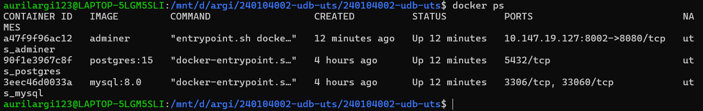
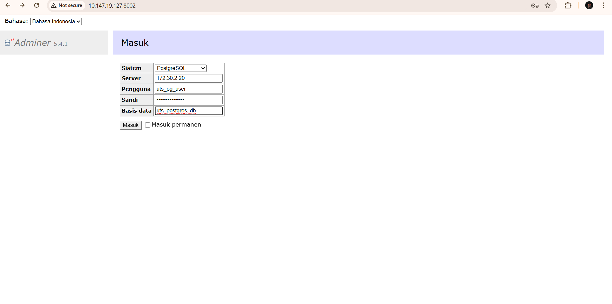
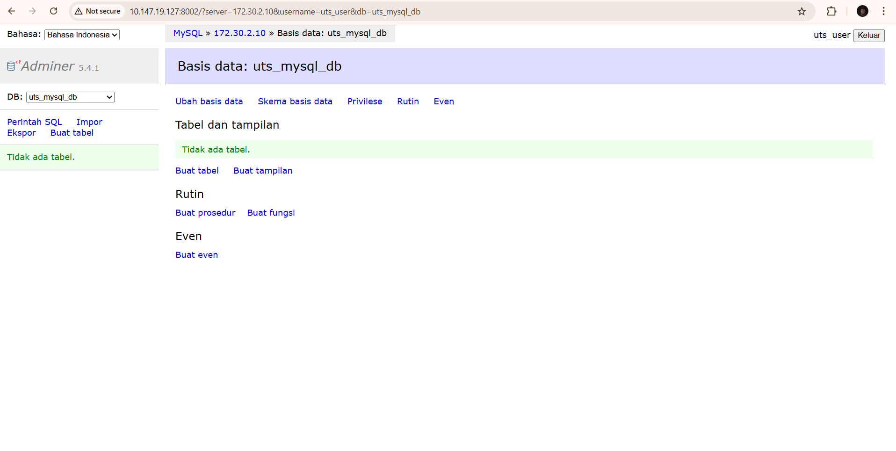
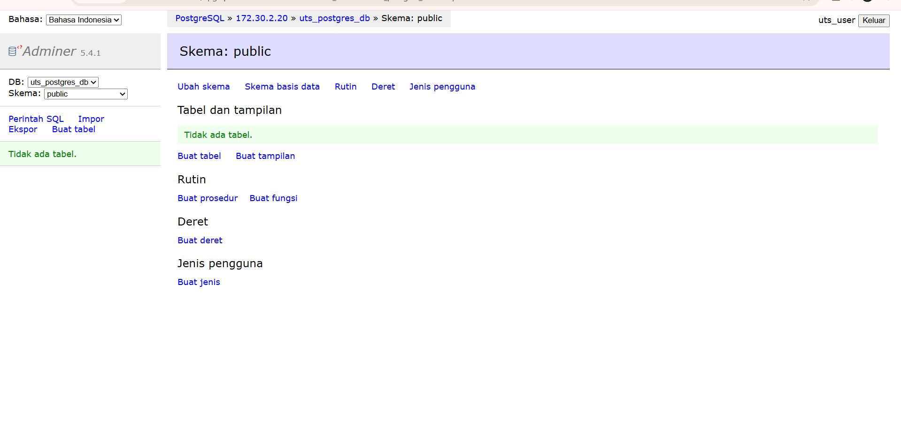

# UTS Praktikum Docker, Database & ZeroTier

## 1. Identitas Mahasiswa

* **Nama** : Auriel Argi Ristama
* **NIM**  : 240104002

---

## 2. Administrator Port yang Digunakan

Adminer dijalankan menggunakan port unik berdasarkan NIM:

* **Adminer Port** : `8002`

(Ketentuan: 8 + 2 digit terakhir NIM → 02)

---

## 3. IP ZeroTier

Adminer hanya dapat diakses melalui IP ZeroTier host.10.147.19.127

* **IP ZeroTier Host** : `(10.147.10.127)`

Contoh akses:

```
http://10.147.19.127:8002
```

---

## 4. Cara Menjalankan Proyek

1. Masuk ke folder project:

```bash
cd 240104002-udb-uts
```

2. Jalankan Docker Compose:

```bash
docker compose up -d
```

3. Pastikan semua container berjalan:

```bash
docker ps
```

---

## 5. Informasi Service Database

### MySQL (internal)

* **Container** : uts_mysql
* **IP Address** : 172.30.2.10
* **Port** : 3306
* **Database** : uts_mysql_db

### PostgreSQL (internal)

* **Container** : uts_postgres
* **IP Address** : 172.30.2.20
* **Port** : 5432
* **Database** : uts_postgres_db

### Adminer

* **Container** : uts_adminer
* **IP Address** : 172.30.2.30
* **Port Host** : 8002

---

## 6. Cara Login Adminer

### Login ke MySQL

* **System** : MySQL
* **Server** : 172.30.2.10
* **Username** : uts_user
* **Password** : uts_password
* **Database** : uts_mysql_db

### Login ke PostgreSQL

* **System** : PostgreSQL
* **Server** : 172.30.2.20
* **Username** : uts_user
* **Password** : uts_password
* **Database** : uts_postgres_db

---

## Screenshots








---

## 8. Catatan

* Semua database berjalan di dalam **Docker custom bridge network**
* Akses database dikontrol menggunakan **ZeroTier**
* Tidak ada port database yang diekspos ke publik

---

> Proyek ini dibuat untuk memenuhi UTS Praktikum Integrasi Docker, Database, dan ZeroTier.
